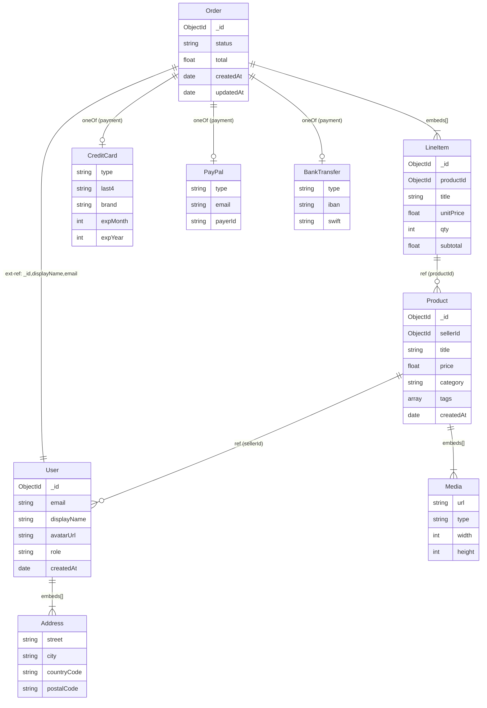

# EDD — Entity Document Diagram

A concise, ERD-inspired notation purpose-built for MongoDB. Use it whenever you reason about,
generate, or review MongoDB schemas.

## Core Idea

Every EDD is a set of **Entities** (collections or named embedded shapes) with typed fields.
Four constructs cover the full MongoDB document model:

| Construct | Syntax | Means |
|---|---|---|
| Scalar | `field: type` | Simple value |
| Embedded entity | `field: EntityName` | Subdocument |
| Extended reference | `field: EntityName{f1,f2,...}` | Denormalized subset from another collection |
| Array | `field: type[min,avg,max]` | Array with cardinality 3-tuple |
| Array of entities | `field: EntityName[min,avg,max]` | Array of embedded subdocs |
| Polymorphic | `field: oneOf(A,B,C)` | Multiple possible shapes |

---

## Notation Reference

### Scalar Fields
```
_id: ObjectId
name: string
createdAt: date
total: decimal128
active: bool
count: int32
ratio: double
meta: object          # free-form subdoc, shape not modeled
raw: any              # truly dynamic
```

Supported scalar types: `string`, `int32`, `int64`, `double`, `decimal128`, `bool`, `date`,
`ObjectId`, `UUID`, `BinData`, `null`, `object`, `any`.

### Embedded Entity
When the field *is* a subdocument and the shape is modeled as a named Entity:
```
address: Address
```
`Address` must appear as its own Entity block in the same diagram. This signals full embedding —
the subdocument is stored inside the parent document, not referenced.

### Extended Reference
When you store only a *subset* of fields from another collection (denormalization):
```
seller: User{_id, displayName, avatarUrl}
```
- `User` = the source collection entity
- `{_id, displayName, avatarUrl}` = the fields actually stored in this document

Use this whenever you copy fields from another collection to avoid a lookup. Always include `_id`
unless the reference is intentionally anonymous.

**Named alias form** (use when the same projection is reused in multiple places):
```
# In the entity:
seller: SellerRef

# Separate alias definition:
SellerRef → User{_id, displayName, avatarUrl}
```

### Arrays
3-tuple = [minimum elements, typical/average elements, maximum elements]:
```
tags: string[0,3,20]
scores: double[1,5,100]
lineItems: LineItem[1,3,50]       # array of embedded entities
events: oneOf(LoginEvent,PurchaseEvent)[0,10,1000]
```
Use `*` for unbounded max: `history: AuditEntry[0,100,*]`

### Polymorphism
```
payment: oneOf(CreditCard, PayPal, BankTransfer)
payload: oneOf(TextMessage, ImageMessage, VideoMessage)[1,1,1]
```
Each variant must be defined as its own Entity.

---

## EDD Block Format

```
Entity: <CollectionOrShapeName>    [indexes: ...]  [shard: <field>]

  <field>: <type notation>
  ...
```

- **indexes** (optional): comma-separated list of index specs, e.g. `{email:1}(unique)`,
  `{loc:"2dsphere"}`, `{text:"text"}`
- **shard** (optional): shard key field name

---

## Relationship Arrows (for diagrams / comments)

When rendering as a diagram or adding relationship comments:

| Arrow | Meaning |
|---|---|
| `──▶` | Reference (stores `_id` of target) |
| `══▶` | Extended reference (stores subset of target) |
| `──◆` | Embedded (subdoc stored inside parent) |
| `──◆[n]` | Embedded array |

---

## Mermaid Diagram Output

**Every EDD output MUST include a Mermaid `erDiagram` block.** Always render the diagram
immediately after the EDD entity blocks — do not wait to be asked.
Follow the mapping rules below to translate every EDD construct into valid Mermaid syntax.

### EDD → Mermaid Relationship Mapping

| EDD construct | Mermaid syntax | Label |
|---|---|---|
| `field: ObjectId` (plain reference `──▶`) | `OWNER \|\|--o{ TARGET : "ref"` | `"ref"` |
| Extended reference `══▶` | `OWNER \|\|--o{ TARGET : "ext-ref"` | `"ext-ref: field1,field2,..."` |
| Embedded subdoc `──◆` | `OWNER \|\|--\|\| SHAPE : "embeds"` | `"embeds"` |
| Embedded array `──◆[n]` | `OWNER \|\|--\|{ SHAPE : "embeds[]"` | `"embeds[]"` |
| Polymorphic `oneOf(A,B,C)` | `OWNER \|\|--o\| A : "oneOf"` (repeat for each variant) | `"oneOf"` |

> **Cardinality shorthand**: use `||--||` for exactly-one, `||--|{` for one-to-many (bounded array),
> `||--o{` for zero-or-more references, and `||--o|` for zero-or-one.

### Field Rendering inside Entities

Use Mermaid's `type fieldName` syntax. Map EDD scalar types as follows:

| EDD type | Mermaid type token |
|---|---|
| `ObjectId` | `ObjectId` |
| `string` | `string` |
| `int32` / `int64` | `int` |
| `double` / `decimal128` | `float` |
| `bool` | `boolean` |
| `date` | `date` |
| `object` / `any` | `object` |
| array field | `array` (add cardinality in the relationship, not the field type) |

Only include **top-level scalar fields** in the entity block (skip embedded sub-entity fields — those
are represented via relationships). Mark collection entities with a comment `%%` and embedded-only
shapes with `%% embedded shape – no collection`.

### Worked Mermaid Example (e-commerce domain)

The diagram below corresponds to the EDD worked example in the next section.



### Generation Rules

1. **Collections only in the diagram title comment** — add `%% Collections` before the first real
   collection entity and `%% embedded shape – no collection` before each embedded-only entity.
2. **One relationship line per EDD arrow** — do not duplicate reverse directions.
3. **Extended reference label** — always list the snapshotted fields in the label so it's clear
   which fields are denormalised: `"ext-ref: _id,displayName,email"`.
4. **Polymorphic variants** — emit one `||--o|` line per variant and append `"oneOf (<fieldName>)"`
   in the label so readers know which field holds the union.
5. **Indexes** — Mermaid `erDiagram` has no index syntax; add them as a fenced code block comment
   beneath the diagram if the user needs them.

---

## Worked Example

**Domain**: e-commerce order with a seller, buyer, and line items.

```
Entity: User    [indexes: {email:1}(unique), {createdAt:-1}]

  _id: ObjectId
  email: string
  displayName: string
  avatarUrl: string
  role: string                    # "buyer" | "seller"
  addresses: Address[0,2,5]
  createdAt: date


Entity: Address                   # embedded-only, no collection

  street: string
  city: string
  countryCode: string
  postalCode: string


Entity: Product    [indexes: {sellerId:1}, {category:1,price:-1}]

  _id: ObjectId
  sellerId: ObjectId              # reference → User
  title: string
  price: decimal128
  category: string
  tags: string[0,5,30]
  media: Media[0,3,20]


Entity: Media                     # embedded-only

  url: string
  type: string                    # "image" | "video"
  width: int32
  height: int32


Entity: Order    [indexes: {buyerId:1,createdAt:-1}, {status:1}]

  _id: ObjectId
  buyer: User{_id,displayName,email}    # extended reference
  lineItems: LineItem[1,5,50]
  payment: oneOf(CreditCard,PayPal,BankTransfer)
  status: string
  total: decimal128
  createdAt: date
  updatedAt: date


Entity: LineItem                  # embedded-only

  productId: ObjectId             # reference → Product
  title: string                   # snapshot at purchase time
  unitPrice: decimal128
  qty: int32
  subtotal: decimal128


Entity: CreditCard                # polymorphic payment variant

  type: string                    # literal "credit_card"
  last4: string
  brand: string
  expMonth: int32
  expYear: int32


Entity: PayPal                    # polymorphic payment variant

  type: string                    # literal "paypal"
  email: string
  payerId: string


Entity: BankTransfer              # polymorphic payment variant

  type: string                    # literal "bank_transfer"
  iban: string
  swift: string
```

---

## Design Rules (apply when generating schemas)

1. **Embed when**: data is always accessed together; child has no independent lifecycle;
   array is bounded (use cardinality 3-tuple to verify).
2. **Reference when**: child is large, updated independently, or accessed in isolation.
3. **Extended reference when**: you need a few fields from a related doc on every read and
   a full `$lookup` would be too expensive. Always document which fields are snapshotted.
4. **Snapshot vs. live**: extended reference fields are a *snapshot at write time*. If the source
   changes, you must decide whether to propagate. Document this decision in a comment.
5. **Cardinality discipline**: never leave an embedded array unbounded — always assign a 3-tuple.
   If max is genuinely unknown, use `*` and flag it for review.
6. **Discriminator field**: polymorphic `oneOf` variants must include a `type: string` field
   (or equivalent) so the shape can be identified at runtime.
7. **Index every query path**: list indexes on the Entity that owns the collection. Compound
   index field order follows ESR rule (Equality → Sort → Range).

---

## Generating Code from EDD

When translating EDD to code (Mongoose, Zod, JSON Schema, TypeScript interfaces):

- Embedded entity → nested schema / interface
- Extended reference → inline object type with only the listed fields; add a comment
  `// extended ref from <Entity>`
- Array 3-tuple → array type; enforce max at application layer or with `$jsonSchema`
- `oneOf(...)` → discriminated union; use the `type` field as the discriminant key
- `ObjectId` references → `Types.ObjectId` (Mongoose) / `string` with `@format objectid`

See `references/code-patterns.md` for ready-to-use snippets.

---

## Quick Checklist — Schema Review

- [ ] Every embedded array has a cardinality 3-tuple
- [ ] Every extended reference lists the snapshotted fields and has a snapshot-propagation note
- [ ] Every polymorphic field has a discriminator field on each variant
- [ ] Every collection Entity has at least one index block
- [ ] No unbounded arrays (`[*]` or missing tuple) without a flag
- [ ] Shard key noted for any collection expected to exceed single-node capacity